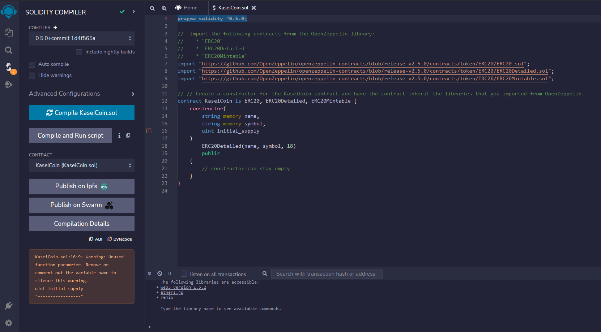
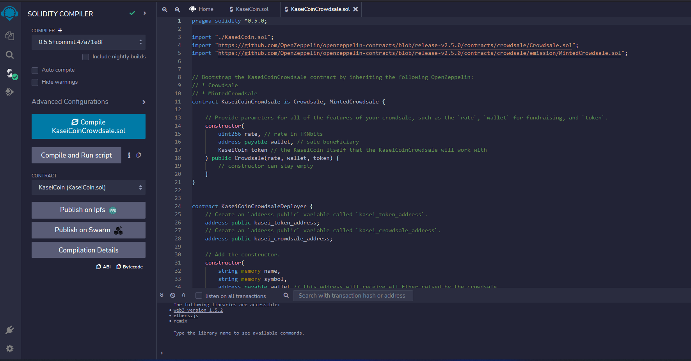
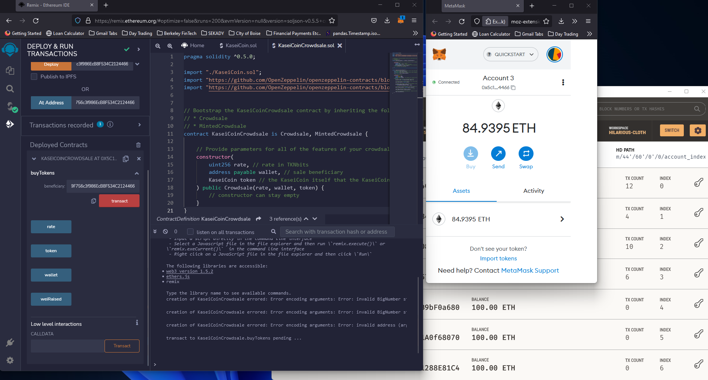
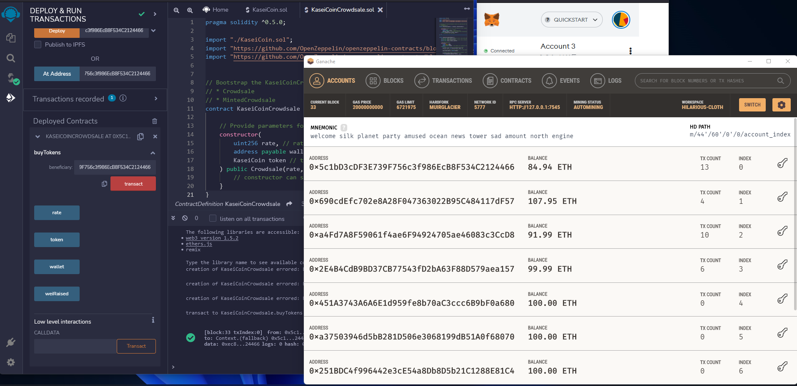
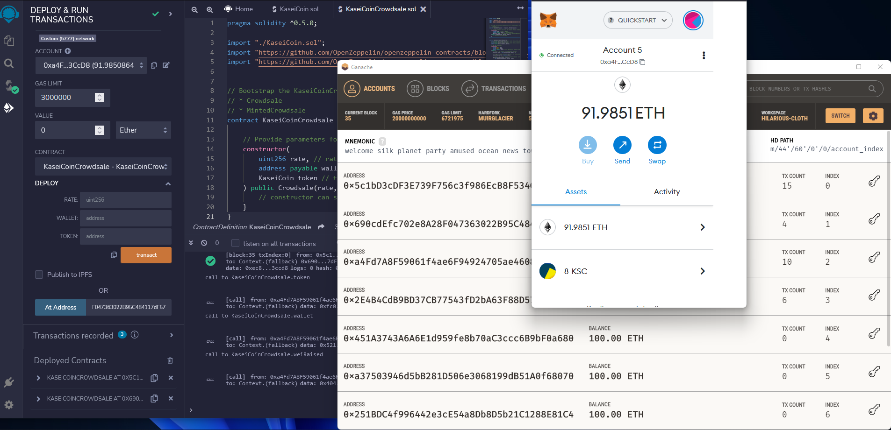

# FinTech Module 21 Challenge: Fungible token that is ERC-20 compliant and that will be minted

In this challenge we:

 - Created the KaseiCoin token contract.
 - Created the KaseiCoin crowdsale contract.
 - Created the KaseiCoin deployer contract.
 - Performed a real-world, pre-production test of your crowdsale. In order to do so, you will deploy the crowdsale to a local blockchain by using Remix, MetaMask, and Ganache.
 - Recorded a short video or take several screenshots that show the deployed contract in action.
 - Optional: Used OpenZeppelin to extend the functionality of your crowdsale contract by adding time restrictions, refund capabilities, and a cap for the number of tokens that may be created.

---

## Usage

---

## Contributors

Grigory Timofeev

[E-mail](fintech_github_challenge21@unloca.com)

---

## License

The MIT License (MIT)

Copyright (c) 2022 Grigory Timofeev

Permission is hereby granted, free of charge, to any person obtaining a copy of this software and associated documentation files (the "Software"), to deal in the Software without restriction, including without limitation the rights to use, copy, modify, merge, publish, distribute, sublicense, and/or sell copies of the Software, and to permit persons to whom the Software is furnished to do so, subject to the following conditions:

The above copyright notice and this permission notice shall be included in all copies or substantial portions of the Software.

THE SOFTWARE IS PROVIDED "AS IS", WITHOUT WARRANTY OF ANY KIND, EXPRESS OR IMPLIED, INCLUDING BUT NOT LIMITED TO THE WARRANTIES OF MERCHANTABILITY, FITNESS FOR A PARTICULAR PURPOSE AND NONINFRINGEMENT. IN NO EVENT SHALL THE AUTHORS OR COPYRIGHT HOLDERS BE LIABLE FOR ANY CLAIM, DAMAGES OR OTHER LIABILITY, WHETHER IN AN ACTION OF CONTRACT, TORT OR OTHERWISE, ARISING FROM, OUT OF OR IN CONNECTION WITH THE SOFTWARE OR THE USE OR OTHER DEALINGS IN THE SOFTWARE.
